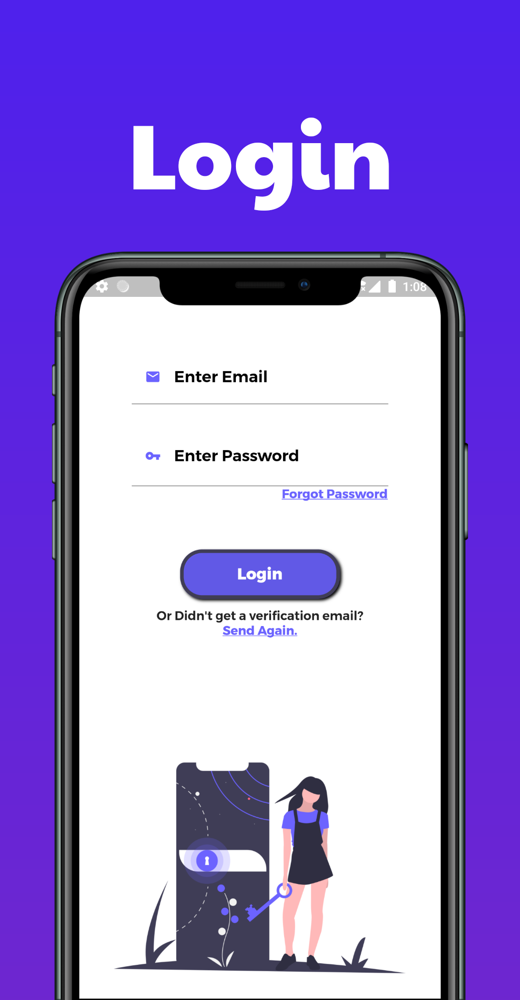
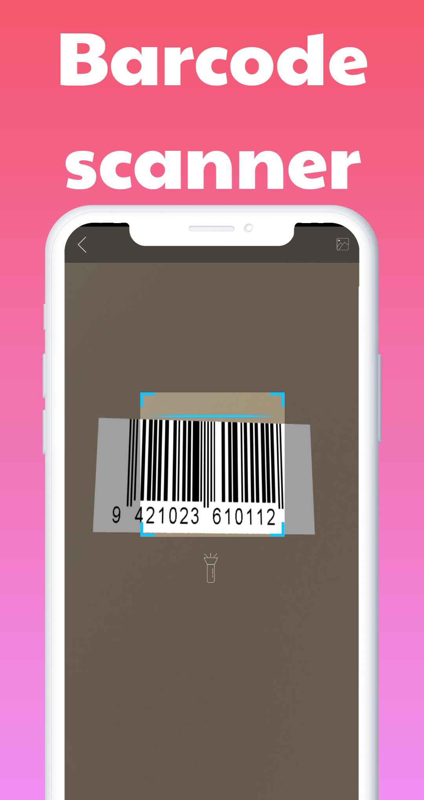
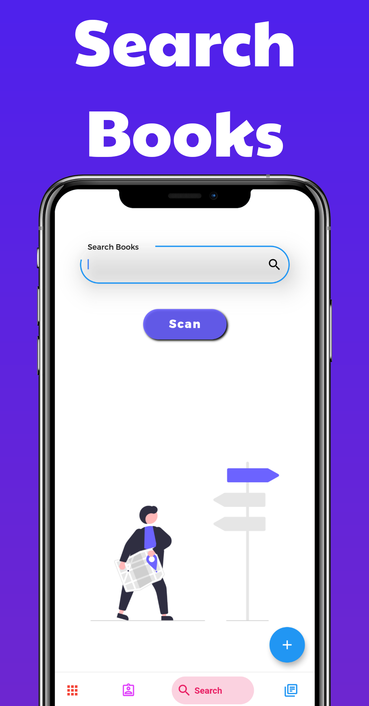

# Library Management System 📕💻

## Intro 📜

Library Management system is a software which is developed to handle the basic tasks of a library. Today in most of the libraries records are maintained manually and thus it makes the current process cumbersome and hectic.

#

## Contributions 🎃🎃

## **<a href = "https://github.com/K0DEL/Hacktoberfest/blob/master/CONTRIBUTING.md">[Refer the CONTRIBUTING.md to get all the details about the app contributions]</a>**

    

<h1 align="center"> Hacktoberfest 2021 🎉</h1>

### 🗣 Hacktoberfest encourages participation in the open source community, which grows bigger every year. Complete the 2021 challenge and earn a limited edition T-shirt.

📢 **Register [here](https://hacktoberfest.digitalocean.com) for Hacktoberfest and make four pull requests (PRs) between October 1st-31st to grab free SWAGS 🔥.**

#

## Our Goal 🎯🎯

Although we build this application due to our academic curriculum but the main motivation/objective of the project to learn basics and concepts of flutter and firebase.

#

## What we created 🛠

So our library management app has two modules:
1 admin module
2 user module
We provided all the basic functionalities of a library management app in our app with a eye soothing UI/UX.

#

## Some Awesome ScreenShots 🔥🔥

**Easy Login and Management of books**

**Scan The books easily and search from the available books**
